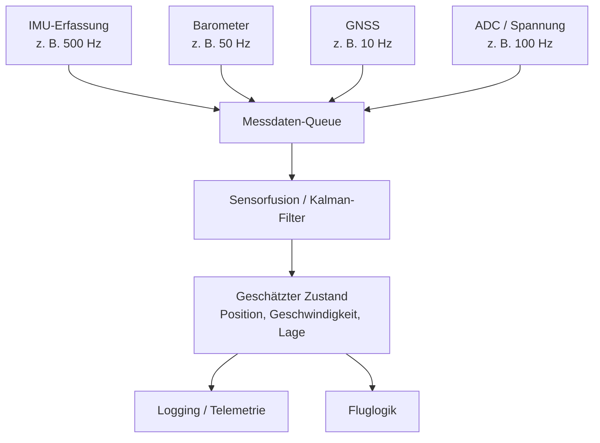

# Telemetry Pipeline

The Vigilant-Engine telemetry pipeline moves device measurements from firmware
producers through encoding, transport, ingestion, and operator-facing outputs.

```mermaid
flowchart TD
    IMU["IMU-Erfassung<br>z. B. 500 Hz"] --> Q["Messdaten-Queue"]
    BARO["Barometer<br>z. B. 50 Hz"] --> Q
    GPS["GNSS<br>z. B. 10 Hz"] --> Q
    ADC["ADC / Spannung<br>z. B. 100 Hz"] --> Q

    Q --> KF["Sensorfusion / Kalman-Filter"]
    KF --> STATE["Geschätzter Zustand<br>Position, Geschwindigkeit, Lage"]
    STATE --> LOG["Logging / Telemetrie"]
    STATE --> CTRL["Fluglogik"]
```
