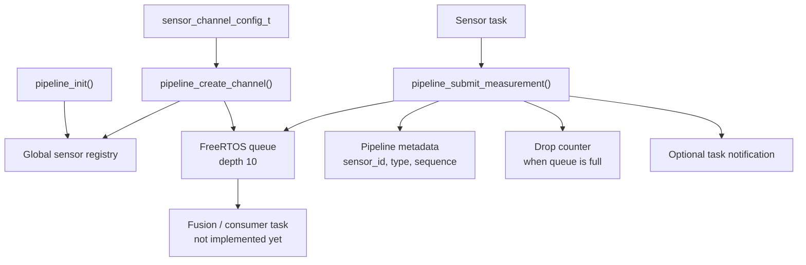

# Telemetry Pipeline

The telemetry pipeline provides a small, uniform path for sensor tasks to publish measurements into per-sensor FreeRTOS queues. Each sensor channel owns one queue, tracks sequence and drop counters, and is registered by a unique channel ID so other tasks can find it later.

The current implementation is intentionally minimal: it creates channels, stores them in a registry, accepts measurements, and optionally notifies a fusion/consumer task. It does not yet implement sensor fusion, queue draining, persistence, or channel destruction.



## Data Model

All sensors publish a `sensor_measurement_t`. The same structure is used for IMU, barometer, GNSS, and ADC measurements.

```c
typedef enum {
    MEASUREMENT_IMU,
    MEASUREMENT_BAROMETER,
    MEASUREMENT_GNSS,
    MEASUREMENT_ADC
} measurement_type_t;

typedef enum {
    MEASUREMENT_VALID = 1 << 0,
    MEASUREMENT_CALIBRATED = 1 << 1,
    MEASUREMENT_SATURATED = 1 << 2,
    MEASUREMENT_ERROR = 1 << 3
} measurement_flags_t;
```

`flags` is a bitmask, so a measurement can combine states, for example `MEASUREMENT_VALID | MEASUREMENT_CALIBRATED`.

```c
typedef struct {
    uint8_t sensor_id;
    measurement_type_t type;

    uint64_t timestamp_us;
    uint32_t sequence;
    uint32_t flags;

    union {
        struct {
            float acceleration[3];
            float angular_velocity[3];
        } imu;

        struct {
            float pressure_pa;
            float temperature_c;
        } barometer;

        struct {
            double latitude_deg;
            double longitude_deg;
            float altitude_m;
            float velocity_mps;
        } gnss;

        struct {
            float voltage_v;
            float current_a;
        } adc;
    } data;
} sensor_measurement_t;
```

Use `esp_timer_get_time()` for `timestamp_us`. It returns microseconds and matches the units used by the pipeline configuration.

When a measurement is submitted, the pipeline copies it before queueing and fills in these fields from the channel:

| Field | Source |
| --- | --- |
| `sensor_id` | `channel->config->id` |
| `type` | `channel->config->measurement_type` |
| `sequence` | `channel->next_sequence++` |

The sensor task should fill the timestamp, flags, and the relevant union payload.

## Sensor Channels

A channel is configured with `sensor_channel_config_t`.

```c
typedef struct {
    uint8_t id;
    const char* name;
    measurement_type_t measurement_type;

    uint32_t nominal_period_us;
    uint32_t notification_bit;
} sensor_channel_config_t;
```

The `id` must be unique across registered channels. There is no fixed `SENSOR_IMU` enum in the current public API; choose stable numeric IDs for your application and keep them consistent.

`nominal_period_us` documents the intended sampling period. The current implementation stores it but does not enforce timing. Sensor tasks should use a delay that matches this value and the configured FreeRTOS tick rate.

`notification_bit` is used only when `channel->fusion_task` has been set. On successful submission, the pipeline calls `xTaskNotify(..., eSetBits)` with this bit. The current API does not yet provide a helper for assigning `fusion_task`.

At runtime, each channel contains pipeline-owned state:

```c
typedef struct {
    const sensor_channel_config_t* config;

    QueueHandle_t queue;
    TaskHandle_t fusion_task;

    uint32_t next_sequence;
    uint32_t dropped_measurements;
} sensor_channel_t;
```

The queue is created dynamically with `xQueueCreate(10, sizeof(sensor_measurement_t))`. It currently holds 10 measurements.

## Registry

The global registry owns the list of created channels:

```c
typedef struct {
    sensor_channel_t** items;
    size_t count;
    size_t capacity;
    SemaphoreHandle_t mutex;
} sensor_channel_registry_t;
```

The registry starts empty, creates a mutex during `pipeline_init()`, grows from capacity 4 by doubling, and rejects duplicate channel IDs with `ESP_ERR_INVALID_STATE`.

Use `get_sensor_registry()` and `sensor_registry_find()` to look up a channel after it has been created:

```c
sensor_channel_t* channel = NULL;
esp_err_t err = sensor_registry_find(get_sensor_registry(), 1, &channel);
if (err != ESP_OK) {
    return err;
}
```

## Lifecycle

`vigilant_init()` initializes the telemetry pipeline automatically after the core networking and optional I2C setup. If you use the telemetry module outside `vigilant_init()`, call `pipeline_init()` before creating channels.

Typical setup:

```c
static const sensor_channel_config_t example_config = {
    .id = 1,
    .name = "Example IMU Sensor",
    .measurement_type = MEASUREMENT_IMU,
    .nominal_period_us = 100000,
};

ESP_ERROR_CHECK(pipeline_create_channel(&example_config));

sensor_channel_t* channel = NULL;
ESP_ERROR_CHECK(sensor_registry_find(get_sensor_registry(), 1, &channel));
```

The `sensor_channel_config_t` is stored by pointer, so it must outlive the channel. Use static storage or another lifetime that remains valid for as long as the channel exists.

`pipeline_deinit()` currently succeeds only when the registry is empty. Since public channel destruction is not implemented yet, this is mainly useful before any channels are created.

## Submitting Measurements

Sensor tasks submit measurements with:

```c
esp_err_t pipeline_submit_measurement(sensor_channel_t* channel,
                                      const sensor_measurement_t* measurement,
                                      TickType_t timeout);
```

Example:

```c
sensor_measurement_t measurement = {
    .timestamp_us = (uint64_t)esp_timer_get_time(),
    .flags = MEASUREMENT_VALID,
    .data.imu = {
        .acceleration = {0.0f, 0.0f, 9.81f},
        .angular_velocity = {0.0f, 0.0f, 0.0f},
    },
};

esp_err_t err = pipeline_submit_measurement(channel, &measurement, 0);
if (err == ESP_ERR_TIMEOUT) {
    ESP_LOGW(TAG, "Measurement dropped, total: %lu",
             (unsigned long)channel->dropped_measurements);
}
```

If the queue is full, submission returns `ESP_ERR_TIMEOUT` and increments `channel->dropped_measurements`. The sequence number is incremented before queueing, so a consumer can detect gaps when drops occur.

The example sensor in `main/sensor/example_sensor.c` uses `xTaskDelayUntil()` to publish simulated IMU measurements every 100 ms. Because there is currently no consumer draining the queue, the example will eventually report dropped measurements. That is expected with the current implementation.

## Current API

Public functions in `telemetry.h`:

| Function | Purpose |
| --- | --- |
| `pipeline_init()` | Initializes the global sensor registry and mutex. |
| `pipeline_create_channel(config)` | Allocates a channel, creates its queue, and registers it. |
| `get_sensor_registry()` | Returns the global registry pointer. |
| `sensor_registry_find(registry, id, out_channel)` | Finds a registered channel by ID. |
| `pipeline_submit_measurement(channel, measurement, timeout)` | Copies metadata into a measurement and sends it to the channel queue. |
| `pipeline_deinit()` | Deinitializes an empty registry. |

Internal helpers in `telemetry.c` include registry initialization, growth, add, and deinit functions. Channel destruction is stubbed in the source today and is not exposed in the public header.

## Implementation Notes

- Channel IDs are `uint8_t` in configs and measurements; `sensor_channel_id_t` is currently `uint32_t` for lookups.
- Registry operations are protected by a FreeRTOS mutex.
- Per-channel fields such as `next_sequence` and `dropped_measurements` are updated by `pipeline_submit_measurement()` and are intended for one producer per channel.
- `pipeline_create_channel()` allocates channel storage with `calloc()` and queue storage through FreeRTOS.
- On channel registration failure, the created queue and channel allocation are cleaned up.
- A future consumer/fusion task should read `sensor_measurement_t` values from each channel queue and handle sequence gaps.
