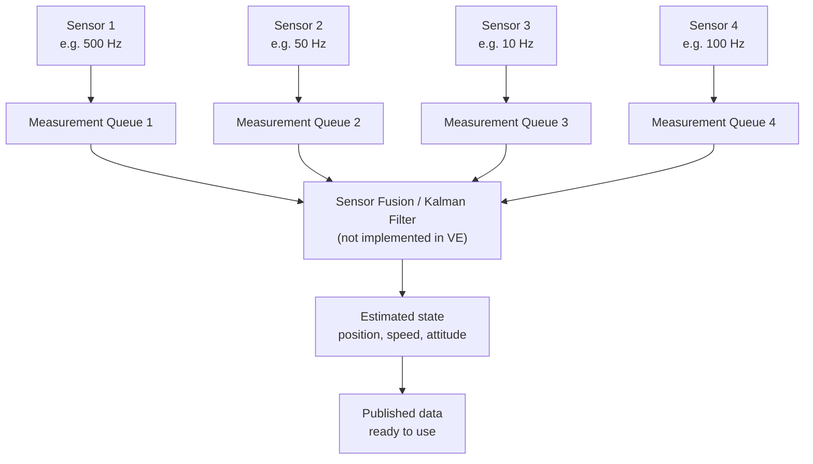

# Telemetry Pipeline

The Vigilant-Engine telemetry pipeline offers a pipeline for feeding sensor data, to uniformly process and retrieve results.



### Uniform Data Model
The pipeline uses a uniform data model, that every sensor must use. The model can be changed to fit your usecase.

##### Types and Flags
```c
typedef enum {
    SENSOR_IMU,
    SENSOR_BAROMETER,
    SENSOR_GNSS,
    SENSOR_ADC,
    SENSOR_COUNT
} sensor_id_t;

typedef enum {
    MEASUREMENT_IMU,
    MEASUREMENT_BAROMETER,
    MEASUREMENT_GNSS,
    MEASUREMENT_ADC
} measurement_type_t;

typedef enum {
    MEASUREMENT_VALID       = 1 << 0,
    MEASUREMENT_CALIBRATED  = 1 << 1,
    MEASUREMENT_SATURATED   = 1 << 2,
    MEASUREMENT_ERROR       = 1 << 3
} measurement_flags_t;
```
Note on the bitshift operator: We utilize the bitshift operator here, so we can have multiple flags at once.

##### Measurement model:
```c
typedef struct {
    sensor_id_t sensor_id;
    measurement_type_t type;

    uint64_t timestamp_us;
    uint32_t sequence;
    uint32_t flags;

    union {
        struct {
            float acceleration[3];
            float angular_velocity[3];
        } imu;

        struct {
            float pressure_pa;
            float temperature_c;
        } barometer;

        struct {
            double latitude_deg;
            double longitude_deg;
            float altitude_m;
            float velocity_mps;
        } gnss;

        struct {
            float voltage_v;
            float current_a;
        } adc;
    } data;
} sensor_measurement_t;
```
**IMPORTANT:** You MUST use `esp_timer_get_time();` to retrieve time, not `get_millis();` or similar!

#### Sensor-Channels
Sensor channels are a way for the pipeline to store the queue and whom it belongs to, in a structured way.

```c
typedef struct {
    sensor_id_t id;
    const char *name;
    measurement_type_t measurement_type;

    uint32_t nominal_period_us;
    uint32_t notification_bit;
} sensor_channel_config_t;
```

```c
typedef struct {
    const sensor_channel_config_t *config;

    QueueHandle_t queue;
    TaskHandle_t fusion_task;

    uint32_t next_sequence;
    uint32_t dropped_measurements;
} sensor_channel_t;
```
The read-write permissions are as follows:

| type                 | Sensor Task | Fusion Task |
| -------------------  | ----------- | ----------- |
| config               | R           | R           |
| queue                | W           | R           |
| next_sequence        | R           | R           |
| dropped_measurements | W           | R           |


### Measurement Queue
In this pipeline, we use a statically allocated FreeRTOS-FIFO-Queue/SPSC-Ringbuffer per sensor. This can be basically used as a ring-buffer. The reason for having one queue per sensor, is beacause every sensor might have different polling intervals, so some sensors might overwrite important data of slow polling sensors in a merged queue.
