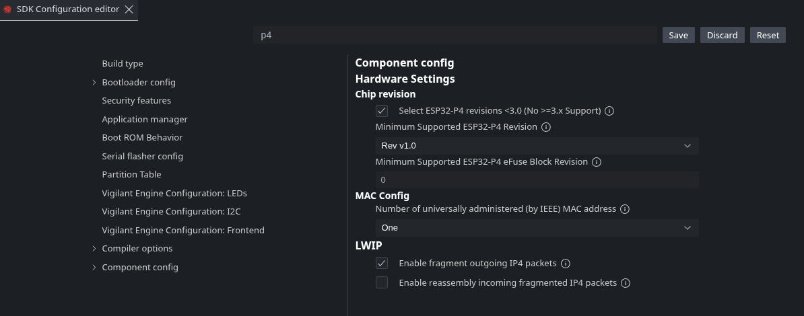

# Troubleshooting

## `IDF_PATH is not set`

You are not in an ESP-IDF exported shell.

- Windows: open ESP-IDF PowerShell
- Linux/macOS: source `export.sh`
- In VS Code, prefer the ESP-IDF extension over generic `CMake Tools`
- If `CMake Tools` logs an include failure for `/tools/cmake/project.cmake`, it launched without the ESP-IDF environment

## `BIN not found`

Make sure your build succeeded and the binaries exist:

- `build/vigilant-engine.bin`
- `build/recovery/vigilant-engine-recovery.bin`

## Port or permission errors

- Close serial monitors (for example `idf.py monitor`) before flashing
- Verify the serial port is correct

## Always booting into the wrong partition

Use `otatool.py` to select the correct slot:

```sh
python $IDF_PATH/components/app_update/otatool.py --port /dev/ttyACM0 switch_ota_partition --slot 0
```

## Flash size mismatch

`flash.py` runs `idf.py reconfigure`, which rebuilds `sdkconfig` from `sdkconfig.defaults`. Set the
correct flash size in `sdkconfig.defaults` so rebuilds keep the proper values.

## IntelliSense highlighting freertos libraries red

In vscode: Ctrl+Shift+P to open command palette, then run: `> ESP-IDF: Add VS Code Configuration Folder`

## esp32p4 chip revision mismatch

Some esp32p4 chips are of older chip revisions. If this is the case, you will get the following error:

```txt
A fatal error occured: 'bootloader/bootloader.bin' requires chip revision in range [v3.1 - v3.99] (this chip is revision v1.3). Use the force argument to flash anyway.
```

To fix this, run `menuconfig` and set the chip revision like this:


